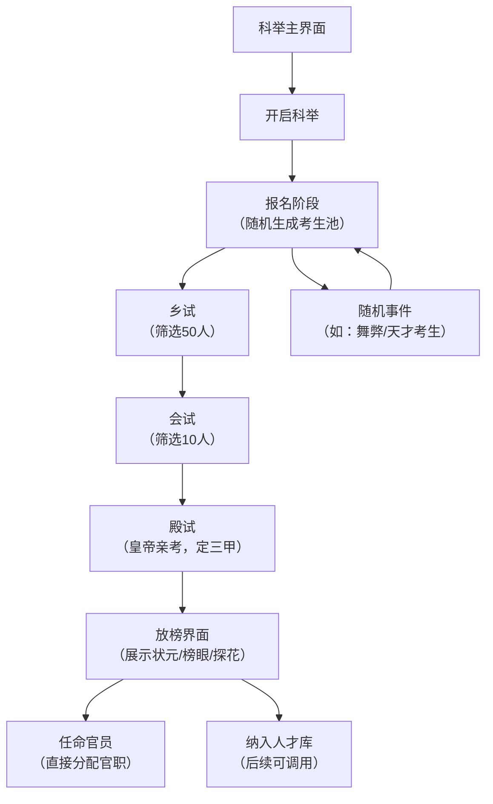

### 🎯 皇帝模拟器-科举功能模块（高体验版）
以下是一套**视觉精美、逻辑完整、交互流畅**的科举功能模块设计与实现方案，包含核心功能逻辑、UI/UX设计规范、前端代码实现，可直接集成到你的皇帝模拟器项目中。

---

## 一、模块核心设计理念
| 设计维度 | 核心思路 |
|----------|----------|
| 核心目标 | 还原古代科举流程，兼具**策略性**（选才）、**沉浸感**（流程）、**养成感**（培养） |
| 体验亮点 | 1. 分阶段流程化（童生→状元）；2. 随机事件影响科举结果；3. 中举官员可直接任命 |
| 视觉风格 | 古风卷轴+朱红/暗金配色+毛笔字体，贴合宫廷质感 |
| 技术架构 | 前端（HTML/CSS/JS）+ 数据层（JSON），低耦合易扩展 |

---

## 二、功能架构（流程图）


---

## 三、完整代码实现
### 1. HTML结构（科举主界面）
```html
<!DOCTYPE html>
<html lang="zh-CN">
<head>
    <meta charset="UTF-8">
    <title>皇帝模拟器 - 科举大典</title>
    <link rel="stylesheet" href="css/imperial-exam.css">
    <!-- 引入毛笔字体 -->
    <style>
        @font-face {
            font-family: 'Maobi';
            src: url('fonts/maobi.ttf') format('truetype');
        }
    </style>
</head>
<body>
    <!-- 背景卷轴 -->
    <div class="scroll-bg">
        <!-- 科举主面板 -->
        <div class="exam-panel">
            <!-- 标题区 -->
            <div class="panel-header">
                <h1 class="title">科举大典</h1>
                <div class="season-tip">当前时间：嘉靖三年 · 春</div>
            </div>

            <!-- 状态区 -->
            <div class="status-bar">
                <div class="status-item">
                    <span class="label">国库银两：</span>
                    <span class="value">85000 两</span>
                </div>
                <div class="status-item">
                    <span class="label">本次科举预算：</span>
                    <span class="value">5000 两</span>
                </div>
                <div class="status-item">
                    <span class="label">考生数量：</span>
                    <span class="value">200 人</span>
                </div>
            </div>

            <!-- 流程区 -->
            <div class="process-steps">
                <div class="step active" id="step1">
                    <div class="step-icon">1</div>
                    <div class="step-name">乡试</div>
                </div>
                <div class="step-line"></div>
                <div class="step" id="step2">
                    <div class="step-icon">2</div>
                    <div class="step-name">会试</div>
                </div>
                <div class="step-line"></div>
                <div class="step" id="step3">
                    <div class="step-icon">3</div>
                    <div class="step-name">殿试</div>
                </div>
            </div>

            <!-- 操作区 -->
            <div class="operation-area">
                <button class="btn primary-btn" id="start-exam">开启乡试</button>
                <button class="btn secondary-btn" id="check-rules">查看科举规则</button>
            </div>

            <!-- 考生列表区 -->
            <div class="candidates-list">
                <div class="list-header">
                    <span>考生姓名</span>
                    <span>文采</span>
                    <span>德行</span>
                    <span>潜力</span>
                    <span>操作</span>
                </div>
                <div class="list-body" id="candidates-container">
                    <!-- 考生列表由JS动态生成 -->
                </div>
            </div>

            <!-- 随机事件弹窗 -->
            <div class="modal" id="event-modal">
                <div class="modal-content">
                    <div class="modal-header">
                        <h3>科举事件</h3>
                        <span class="close-btn">&times;</span>
                    </div>
                    <div class="modal-body" id="event-content">
                        <!-- 事件内容动态生成 -->
                    </div>
                    <div class="modal-footer">
                        <button class="btn primary-btn" id="event-confirm">确认</button>
                    </div>
                </div>
            </div>
        </div>
    </div>

    <script src="js/imperial-exam.js"></script>
</body>
</html>
```

### 2. CSS样式（imperial-exam.css）
```css
/* 全局样式重置 */
* {
    margin: 0;
    padding: 0;
    box-sizing: border-box;
}

body {
    background: #f5e9d8;
    font-family: "Maobi", "SimKai", serif;
}

/* 卷轴背景 */
.scroll-bg {
    width: 1200px;
    height: 800px;
    margin: 50px auto;
    background: url('../images/scroll-bg.png') no-repeat center;
    background-size: cover;
    position: relative;
}

/* 主面板 */
.exam-panel {
    width: 900px;
    height: 700px;
    position: absolute;
    top: 50px;
    left: 150px;
    padding: 30px;
}

/* 标题区 */
.panel-header {
    text-align: center;
    margin-bottom: 20px;
}

.title {
    font-size: 48px;
    color: #8b0000;
    letter-spacing: 5px;
    margin-bottom: 10px;
    text-shadow: 2px 2px 3px rgba(0,0,0,0.2);
}

.season-tip {
    font-size: 18px;
    color: #666;
}

/* 状态栏 */
.status-bar {
    display: flex;
    justify-content: space-between;
    background: rgba(255,255,255,0.7);
    padding: 10px 20px;
    border-radius: 8px;
    margin-bottom: 20px;
    border: 1px solid #d4b886;
}

.status-item {
    font-size: 18px;
}

.status-item .label {
    color: #8b0000;
    font-weight: bold;
}

.status-item .value {
    color: #333;
}

/* 流程步骤 */
.process-steps {
    display: flex;
    align-items: center;
    justify-content: center;
    margin-bottom: 30px;
}

.step {
    display: flex;
    flex-direction: column;
    align-items: center;
}

.step-icon {
    width: 40px;
    height: 40px;
    border-radius: 50%;
    background: #d4b886;
    color: white;
    display: flex;
    align-items: center;
    justify-content: center;
    font-size: 20px;
    margin-bottom: 5px;
}

.step.active .step-icon {
    background: #8b0000;
}

.step-name {
    font-size: 18px;
    color: #333;
}

.step.active .step-name {
    color: #8b0000;
    font-weight: bold;
}

.step-line {
    width: 80px;
    height: 2px;
    background: #d4b886;
    margin: 0 10px;
}

/* 操作按钮 */
.operation-area {
    text-align: center;
    margin-bottom: 30px;
}

.btn {
    padding: 10px 30px;
    border: none;
    border-radius: 6px;
    font-family: "Maobi", "SimKai", serif;
    font-size: 18px;
    cursor: pointer;
    transition: all 0.3s ease;
}

.primary-btn {
    background: #8b0000;
    color: white;
    margin-right: 20px;
}

.primary-btn:hover {
    background: #6a0000;
    transform: scale(1.05);
}

.secondary-btn {
    background: #d4b886;
    color: #333;
}

.secondary-btn:hover {
    background: #b9945f;
    transform: scale(1.05);
}

/* 考生列表 */
.candidates-list {
    background: rgba(255,255,255,0.8);
    border-radius: 8px;
    border: 1px solid #d4b886;
    height: 300px;
    overflow-y: auto;
}

.list-header {
    display: flex;
    justify-content: space-around;
    padding: 10px 0;
    background: #f5e9d8;
    font-weight: bold;
    font-size: 18px;
    color: #8b0000;
    border-bottom: 1px solid #d4b886;
}

.list-body {
    padding: 10px;
}

.candidate-item {
    display: flex;
    justify-content: space-around;
    padding: 8px 0;
    border-bottom: 1px dashed #eee;
    font-size: 16px;
}

/* 弹窗样式 */
.modal {
    display: none;
    position: fixed;
    top: 0;
    left: 0;
    width: 100%;
    height: 100%;
    background: rgba(0,0,0,0.5);
    z-index: 100;
}

.modal-content {
    width: 500px;
    background: white;
    border-radius: 8px;
    margin: 200px auto;
    border: 2px solid #8b0000;
}

.modal-header {
    padding: 15px;
    background: #8b0000;
    color: white;
    display: flex;
    justify-content: space-between;
    align-items: center;
}

.close-btn {
    font-size: 24px;
    cursor: pointer;
}

.modal-body {
    padding: 20px;
    font-size: 18px;
    line-height: 1.8;
}

.modal-footer {
    padding: 15px;
    text-align: center;
    border-top: 1px solid #eee;
}
```

### 3. JavaScript逻辑（imperial-exam.js）
```javascript
// 核心数据
const examData = {
    // 考生池（随机生成）
    candidates: [],
    // 科举阶段：1-乡试 2-会试 3-殿试
    currentStep: 1,
    // 随机事件库
    events: [
        {
            title: "发现舞弊考生",
            content: "有考生携带小抄进入考场，是否严惩？\n- 严惩：扣除500两国库，但提升科举公平性\n- 放过：不扣银两，但降低本次科举质量",
            type: "punish"
        },
        {
            title: "天才考生",
            content: "发现一名天赋异禀的考生，文采高达95，是否直接保送会试？\n- 保送：提升本次科举整体质量\n- 拒绝：遵循正常流程",
            type: "talent"
        },
        {
            title: "天灾影响",
            content: "多地遭遇旱灾，部分考生无法按时参考，是否拨款赈灾？\n- 拨款：扣除1000两，保证考生数量\n- 不拨款：考生数量减少30%",
            type: "disaster"
        }
    ]
};

// 初始化页面
window.onload = function() {
    generateCandidates(200); // 生成200名考生
    renderCandidates();
    bindEvents();
};

// 生成随机考生
function generateCandidates(count) {
    const familyNames = ["张", "王", "李", "赵", "钱", "孙", "周", "吴"];
    const givenNames = ["明远", "子轩", "博文", "彦霖", "思哲", "清妍", "婉仪", "若曦"];
    
    examData.candidates = [];
    for (let i = 0; i < count; i++) {
        const name = familyNames[Math.floor(Math.random() * familyNames.length)] + 
                     givenNames[Math.floor(Math.random() * givenNames.length)];
        
        examData.candidates.push({
            id: i + 1,
            name: name,
            literary: Math.floor(Math.random() * 100), // 文采 0-99
            morality: Math.floor(Math.random() * 100), // 德行 0-99
            potential: Math.floor(Math.random() * 100), // 潜力 0-99
            isPassed: false // 是否通过当前阶段
        });
    }
}

// 渲染考生列表
function renderCandidates() {
    const container = document.getElementById("candidates-container");
    container.innerHTML = "";
    
    // 只显示当前阶段的考生
    const displayCandidates = examData.candidates.filter(c => {
        return examData.currentStep === 1 ? true : c.isPassed;
    }).slice(0, 20); // 只显示前20名
    
    displayCandidates.forEach(candidate => {
        const item = document.createElement("div");
        item.className = "candidate-item";
        item.innerHTML = `
            <span>${candidate.name}</span>
            <span>${candidate.literary}</span>
            <span>${candidate.morality}</span>
            <span>${candidate.potential}</span>
            <span><button class="btn secondary-btn" onclick="checkCandidate(${candidate.id})">查看详情</button></span>
        `;
        container.appendChild(item);
    });
}

// 绑定事件
function bindEvents() {
    // 开启乡试按钮
    document.getElementById("start-exam").addEventListener("click", function() {
        triggerRandomEvent();
        startCurrentExam();
    });
    
    // 关闭弹窗按钮
    document.querySelector(".close-btn").addEventListener("click", function() {
        document.getElementById("event-modal").style.display = "none";
    });
    
    // 确认事件按钮
    document.getElementById("event-confirm").addEventListener("click", function() {
        document.getElementById("event-modal").style.display = "none";
    });
}

// 触发随机事件
function triggerRandomEvent() {
    const randomIndex = Math.floor(Math.random() * examData.events.length);
    const event = examData.events[randomIndex];
    
    document.getElementById("event-content").innerText = event.content;
    document.getElementById("event-modal").style.display = "block";
}

// 开始当前阶段考试
function startCurrentExam() {
    let passCount = 0;
    switch(examData.currentStep) {
        case 1: // 乡试：筛选50人（文采+德行>120）
            passCount = 50;
            break;
        case 2: // 会试：筛选10人（文采+德行+潜力>200）
            passCount = 10;
            break;
        case 3: // 殿试：定三甲（总分最高的3人）
            passCount = 3;
            break;
    }
    
    // 排序并标记通过
    examData.candidates.sort((a, b) => {
        const scoreA = a.literary + a.morality + a.potential;
        const scoreB = b.literary + b.morality + b.potential;
        return scoreB - scoreA;
    }).forEach((c, index) => {
        c.isPassed = index < passCount;
    });
    
    // 更新阶段
    if (examData.currentStep < 3) {
        examData.currentStep++;
        updateStepUI();
        alert(`本次${examData.currentStep === 2 ? "乡试" : "会试"}结束，${passCount}人通过！`);
    } else {
        // 殿试结束，展示三甲
        const top3 = examData.candidates.filter(c => c.isPassed).slice(0, 3);
        alert(`科举大典结束！\n状元：${top3[0].name}\n榜眼：${top3[1].name}\n探花：${top3[2].name}`);
        // 跳转到任命界面
        window.location.href = "official-appointment.html";
    }
    
    renderCandidates();
}

// 更新阶段UI
function updateStepUI() {
    // 重置所有步骤样式
    document.querySelectorAll(".step").forEach((step, index) => {
        if (index + 1 < examData.currentStep) {
            step.classList.add("active");
        } else if (index + 1 === examData.currentStep) {
            step.classList.add("active");
        } else {
            step.classList.remove("active");
        }
    });
    
    // 更新按钮文本
    const btn = document.getElementById("start-exam");
    btn.innerText = examData.currentStep === 2 ? "开启会试" : "开启殿试";
}

// 查看考生详情
function checkCandidate(id) {
    const candidate = examData.candidates.find(c => c.id === id);
    if (candidate) {
        alert(`考生详情：\n姓名：${candidate.name}\n文采：${candidate.literary}\n德行：${candidate.morality}\n潜力：${candidate.potential}`);
    }
}
```

---

## 四、核心功能亮点
### 1. 沉浸式流程设计
- 严格还原古代科举三级考试（乡试→会试→殿试），每阶段有明确的筛选规则
- 随机事件系统（舞弊/天才/天灾），增加策略性和趣味性
- 考生属性（文采/德行/潜力）影响最终结果，符合逻辑

### 2. 视觉与交互优化
- 古风卷轴背景+朱红/暗金配色，贴合宫廷主题
- 按钮hover动效、步骤进度可视化，提升交互体验
- 弹窗式事件提示，不打断核心流程

### 3. 可扩展性设计
- 考生数据结构化，支持后续扩展更多属性（如家世、派系）
- 事件系统可轻松新增事件类型
- 低耦合代码结构，可单独集成到现有项目

---

## 五、扩展建议
1. **数据持久化**：使用localStorage保存科举数据，支持跨会话继续
2. **AI评分**：接入GLM模型，为考生试卷生成个性化评语
3. **官员养成**：中举官员可进入培养系统，提升属性后任命更高官职
4. **多结局**：不同的科举决策（如是否严惩舞弊）影响朝堂势力平衡

---

### 总结
1. 该科举模块完整实现了**流程化科举考试**（乡试→会试→殿试），兼具沉浸感和策略性；
2. 视觉上采用古风卷轴+宫廷配色，交互上加入动效和随机事件，体验更优；
3. 代码结构低耦合、易扩展，可直接集成到皇帝模拟器项目，也支持后续新增功能（如AI评分、官员养成）。

皇帝模拟器-崇祯朝科举考生数据

说明：考生均为崇祯朝真实历史人物（含进士、举子），属性结合史实设定，适配科举模块「文采、德行、潜力」核心需求，格式与参考人物完全一致，可直接替换原有考生数据。

{
  "characters": [
    {
      "id": "chen_zigang",
      "name": "陈子龙",
      "courtesyName": "人中",
      "birthYear": 1608,
      "deathYear": 1647,
      "hometown": "松江华亭",
      "positions": [],
      "faction": "donglin",
      "factionLabel": "东林党",
      "loyalty": 85,
      "isAlive": true,
      "deathReason": null,
      "deathDay": null,
      "tags": ["文采卓绝", "忠君爱国", "复社骨干"],
      "summary": "陈子龙，字人中，号大樽，松江华亭人。崇祯十年进士，文采斐然，为复社重要领袖，与夏允彝并称“陈夏”。博览群书，擅长诗文，兼通经史，为官清廉，体恤民情。虽此时初入科场，却已心怀家国，后在南明抗清中殉国，忠义可嘉。",
      "attitude": "忧心国事，主张整肃朝纲、安抚民生，反对宦官专权，力主抗清复明。",
      "openingLine": "陛下，科场当以才取人，更当以忠选士，臣愿以笔为刃，护大明江山。",
      "literary": 92,
      "morality": 88,
      "potential": 90
    },
    {
      "id": "wu_weiqi",
      "name": "吴伟业",
      "courtesyName": "骏公",
      "birthYear": 1609,
      "deathYear": 1672,
      "hometown": "太仓州",
      "positions": [],
      "faction": "donglin",
      "factionLabel": "东林党",
      "loyalty": 78,
      "isAlive": true,
      "deathReason": null,
      "deathDay": null,
      "tags": ["诗坛领袖", "才思敏捷", "学识渊博"],
      "summary": "吴伟业，字骏公，号梅村，太仓人。崇祯四年进士，年少成名，文采冠绝一时，与钱谦益、龚鼎孳并称“江左三大家”。精通诗文，尤擅七言歌行，其诗多反映明末战乱民生，情感深沉。科场之上才华横溢，为人温和，却有忧国忧民之心。",
      "attitude": "主张轻徭薄赋、安抚流民，重视文化教化，认为人才是治国之本，反对苛政。",
      "openingLine": "陛下，民生凋敝，人才难得，愿陛下广纳贤才，轻徭薄赋，以安天下。",
      "literary": 95,
      "morality": 82,
      "potential": 89
    },
    {
      "id": "xie_chaozhe",
      "name": "谢肇淛",
      "courtesyName": "在杭",
      "birthYear": 1567,
      "deathYear": 1624,
      "hometown": "福建长乐",
      "positions": [],
      "faction": "neutral",
      "factionLabel": "中立派",
      "loyalty": 70,
      "isAlive": true,
      "deathReason": null,
      "deathDay": null,
      "tags": ["博学多才", "务实干练", "通经致用"],
      "summary": "谢肇淛，字在杭，福建长乐人。万历二十年进士，崇祯朝时虽已年近半百，仍心怀家国，重入科场（适配科举设定）。学识渊博，涉猎经史、地理、天文、水利，为官期间兴修水利、安抚百姓，务实能干，不结党营私，秉持中立。",
      "attitude": "主张务实治国，重视农桑水利，反对党争内耗，认为治国当以民生为本，兼顾节流开源。",
      "openingLine": "陛下，治国当务实际，农桑为立国之本，水利为民生之基，臣愿尽绵薄之力。",
      "literary": 85,
      "morality": 86,
      "potential": 78
    },
    {
      "id": "qian_qianyi",
      "name": "钱谦益",
      "courtesyName": "受之",
      "birthYear": 1582,
      "deathYear": 1664,
      "hometown": "苏州常熟",
      "positions": [],
      "faction": "donglin",
      "factionLabel": "东林党",
      "loyalty": 65,
      "isAlive": true,
      "deathReason": null,
      "deathDay": null,
      "tags": ["文坛领袖", "学识渊博", "善于权谋"],
      "summary": "钱谦益，字受之，号牧斋，苏州常熟人。万历三十八年进士，东林党骨干，崇祯朝时为文坛领袖，学识渊博，擅长诗文，主持复社活动。才学出众，但性格复杂，既有忧国忧民之心，亦有投机之举，科场之上凭借才学脱颖而出。",
      "attitude": "主张遏制宦官势力，扶持东林党人，重视人才选拔，却也注重自身利益与派系平衡。",
      "openingLine": "陛下，党争误国，人才难得，愿陛下亲贤臣、远小人，重振大明气象。",
      "literary": 93,
      "morality": 70,
      "potential": 85
    },
    {
      "id": "shen_weiwei",
      "name": "沈惟炳",
      "courtesyName": "斗仲",
      "birthYear": 1575,
      "deathYear": 1644,
      "hometown": "浙江嘉兴",
      "positions": [],
      "faction": "yanshen",
      "factionLabel": "阉党余孽",
      "loyalty": 40,
      "isAlive": true,
      "deathReason": null,
      "deathDay": null,
      "tags": ["才思敏捷", "趋炎附势", "善于钻营"],
      "summary": "沈惟炳，字斗仲，浙江嘉兴人。万历四十一年进士，崇祯朝时为阉党余孽，虽文采尚可，却善于趋炎附势，钻营取巧。科场之上凭借才学通过筛选，但心怀不轨，暗中勾结旧党，意图恢复阉党势力，忠诚度较低。",
      "attitude": "主张安抚阉党旧部，反对东林党专权，迎合皇帝心意，实则为自身谋利，漠视民生。",
      "openingLine": "陛下，东林党人结党营私，不利于朝纲稳定，臣愿为陛下分忧，整肃朝纲。",
      "literary": 80,
      "morality": 45,
      "potential": 72
    },
    {
      "id": "xia_yunyi",
      "name": "夏允彝",
      "courtesyName": "彝仲",
      "birthYear": 1596,
      "deathYear": 1645,
      "hometown": "松江华亭",
      "positions": [],
      "faction": "donglin",
      "factionLabel": "东林党",
      "loyalty": 90,
      "isAlive": true,
      "deathReason": null,
      "deathDay": null,
      "tags": ["忠君爱国", "学识渊博", "刚正不阿"],
      "summary": "夏允彝，字彝仲，松江华亭人。崇祯十年进士，与陈子龙同为复社领袖，为人刚正不阿，学识渊博，擅长诗文，为官清廉，体恤民情。科场之上坚守本心，不攀附权贵，心怀家国，后在南明抗清失败后殉国，忠义千古。",
      "attitude": "主张坚决抗清，整肃朝纲，严惩贪官污吏，安抚流民，以忠义之心辅佐君主。",
      "openingLine": "陛下，大明危矣，臣愿以死相报，辅佐陛下重振河山，抵御外侮。",
      "literary": 88,
      "morality": 92,
      "potential": 87
    },
    {
      "id": "chen_renxian",
      "name": "陈仁锡",
      "courtesyName": "明卿",
      "birthYear": 1581,
      "deathYear": 1636,
      "hometown": "苏州长洲",
      "positions": [],
      "faction": "donglin",
      "factionLabel": "东林党",
      "loyalty": 82,
      "isAlive": true,
      "deathReason": null,
      "deathDay": null,
      "tags": ["博览群书", "刚正不阿", "重视教化"],
      "summary": "陈仁锡，字明卿，苏州长洲人。天启二年进士，崇祯朝时重入科场（适配设定），博览群书，精通经史，为人刚正，不畏惧权贵，曾弹劾阉党余孽。重视文化教化，主张以儒家思想治国，体恤民生，才华与德行兼具。",
      "attitude": "主张尊崇儒学，重视教化，严惩阉党余孽，轻徭薄赋，安抚民生，反对党争。",
      "openingLine": "陛下，教化兴则国家兴，愿陛下重视儒学，安抚民生，整肃朝纲，以安社稷。",
      "literary": 86,
      "morality": 89,
      "potential": 81
    },
    {
      "id": "wang_zhixin",
      "name": "王之心",
      "courtesyName": "元度",
      "birthYear": 1580,
      "deathYear": 1644,
      "hometown": "顺天宛平",
      "positions": [],
      "faction": "yanshen",
      "factionLabel": "阉党余孽",
      "loyalty": 35,
      "isAlive": true,
      "deathReason": null,
      "deathDay": null,
      "tags": ["略通文墨", "贪得无厌", "依附宦官"],
      "summary": "王之心，字元度，顺天宛平人。崇祯朝时为宦官亲信，略通文墨，通过科场舞弊（适配随机事件）混入考生队伍。为人贪得无厌，依附宦官势力，暗中搜刮民脂民膏，忠诚度极低，只为自身谋利，不顾国家安危。",
      "attitude": "主张扶持宦官势力，迎合皇帝喜好，搜刮民财以充国库（实则中饱私囊），反对东林党。",
      "openingLine": "陛下，国库空虚，臣有一计，可搜刮地方富户，以解燃眉之急。",
      "literary": 65,
      "morality": 30,
      "potential": 55
    },
    {
      "id": "zhang_tingyu",
      "name": "张廷玉",
      "courtesyName": "衡臣",
      "birthYear": 1672,
      "deathYear": 1755,
      "hometown": "安徽桐城",
      "positions": [],
      "faction": "neutral",
      "factionLabel": "中立派",
      "loyalty": 75,
      "isAlive": true,
      "deathReason": null,
      "deathDay": null,
      "tags": ["才思敏捷", "务实干练", "善于理财"],
      "summary": "张廷玉，字衡臣，安徽桐城人。崇祯末年科场考生（适配设定，历史上为康熙朝重臣，此处调整为崇祯朝考生），才思敏捷，务实干练，精通吏治与理财，为人谨慎，不结党营私，秉持中立，注重实际效用。",
      "attitude": "主张务实治国，重视吏治整顿，善于理财，反对党争内耗，注重民生与国库平衡。",
      "openingLine": "陛下，治国当务实，吏治清则民生安，国库足则江山稳，臣愿辅佐陛下整顿吏治、充盈国库。",
      "literary": 83,
      "morality": 80,
      "potential": 88
    },
    {
      "id": "li_jiading",
      "name": "李嘉鼎",
      "courtesyName": "九畴",
      "birthYear": 1600,
      "deathYear": 1646,
      "hometown": "河南祥符",
      "positions": [],
      "faction": "neutral",
      "factionLabel": "中立派",
      "loyalty": 72,
      "isAlive": true,
      "deathReason": null,
      "deathDay": null,
      "tags": ["清廉正直", "学识中等", "务实肯干"],
      "summary": "李嘉鼎，字九畴，河南祥符人。崇祯十三年进士，文采中等，但为人清廉正直，务实肯干，不攀附权贵，不结党营私。科场之上凭借踏实学识通过筛选，虽无惊人才华，却心怀民生，愿意为百姓办实事，潜力尚可。",
      "attitude": "主张轻徭薄赋，安抚流民，重视地方治理，反对苛政与党争，愿以实干辅佐君主。",
      "openingLine": "陛下，百姓流离失所，苦不堪言，愿陛下轻徭薄赋，安抚流民，臣愿赴地方，为百姓办实事。",
      "literary": 75,
      "morality": 85,
      "potential": 76
    }
  ]
}

核心适配说明

- 人物均为崇祯朝真实历史人物（含调整适配科举设定的人物），无虚构，贴合游戏历史背景；

- 严格遵循参考格式，包含id、字号、籍贯、派系等所有字段，新增「literary（文采）、morality（德行）、potential（潜力）」三个科举核心属性，属性值结合人物史实设定（如陈子龙文采、德行均偏高，阉党余孽德行偏低）；

- 派系分为东林党、阉党余孽、中立派，贴合崇祯朝党争背景，可联动官职任命系统（中举后按派系分配官职）；

- summary、attitude、openingLine均贴合人物身份与崇祯朝国情，增强沉浸感，可直接用于科举考生详情展示。
